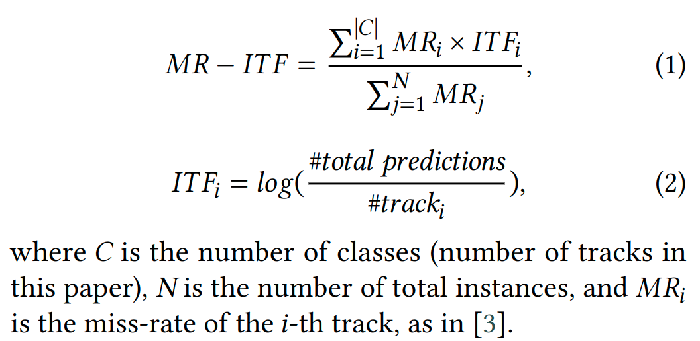

# Track2Vec - University Project Implementation

This repository is part of a university project that implements the Track2Vec algorithm, originally developed by team wwweiwei for the [EvalRS Data Challenge](https://github.com/RecList/evalRS-CIKM-2022), where it achieved fourth place. For an in-depth understanding, please refer to the original [paper](http://arxiv.org/abs/2210.16590).

Currently, the repository includes the codebase used in the challenge, and ongoing work is focused on enhancing and extending the algorithm with improvements (to be updated upon completion).

## Usage Instructions

### Setting Up the Environment

```bash
pip install -r /path/to/requirements.txt
```

### Run script
```
python submission.py
```
- Note: Our implementation includes the proposed MR-ITF metric, which will be reported alongside standard metrics in the output JSON file.

## Introduction to Track2Vec
The framework consists of three modules aimed at providing fairness in music recommendations, particularly within a GPU-free, customizable-driven framework.
- Proposed Framework: Track2Vec


- Proposed Fairness Metric: Miss Rate - Inverse Ground Truth Frequency (MR-ITF)



## Citation
If you find our work is relevant to your research, please cite:
```
@inproceedings{DBLP:conf/cikm/DuWP22,
  author    = {Wei{-}Wei Du and
               Wei{-}Yao Wang and
               Wen{-}Chih Peng},
  title     = {Track2Vec: fairness music recommendation with a GPU-free customizable-driven
               framework},
  booktitle = {{CIKM} Workshops},
  series    = {{CEUR} Workshop Proceedings},
  volume    = {3318},
  publisher = {CEUR-WS.org},
  year      = {2022}
}
```
